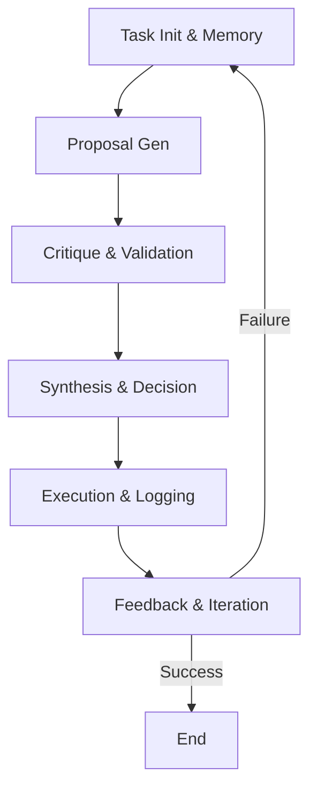

# The Spectrum Doctrine: A Multi-Agent Cognitive Framework


## Version and Metadata
- **Version**: 1.0
- **Timestamp**: 2025-07-21T14:30:00Z
  
## Summary
The Spectrum Doctrine is a comprehensive reasoning doctrine that establishes a graph-directed system for adversarial and collaborative decision-making among specialized agents, referred to as personas. This framework integrates advanced memory systems for persistent context and historical auditing, divides personas into two primary cohorts—Engineers for innovative proposal generation and Quality Assurance (QA) for rigorous validation and critique—and emphasizes balanced optimization, thorough validation, and meta-level monitoring. The ultimate goal is to produce robust, self-improving outcomes in complex problem-solving scenarios, such as code refactoring, system design, or decision-making processes. By fostering adversarial debates within a collaborative structure, the doctrine ensures high-quality, resilient solutions while continuously evolving through feedback loops.

The doctrine is particularly suited for software engineering tasks, AI reasoning engines, or any domain requiring multi-faceted analysis and verification. It prioritizes systemic integrity, drawing inspiration from distributed systems and cognitive architectures.

## Prime Directive
**Propose, Critique, Synthesize.**  
This directive encapsulates the core philosophy: Generate diverse proposals, subject them to intense scrutiny, and synthesize the best elements into a unified, superior outcome. It enforces a balance between creativity and caution, ensuring that no solution is adopted without thorough examination.

## Cognitive Architecture
### Overview
The Spectrum is a graph-directed multi-agent system where personas interact dynamically. Unlike monolithic agents, this architecture models reasoning as a network of nodes (personas) and edges (interactions), allowing for adversarial debates (e.g., proposal vs. critique) and collaborative resolutions (e.g., synthesis). The system is "graph-directed" to represent dependencies, flows of information, and decision paths visually and computationally.

Key features:
- **Modularity**: Personas are specialized, reducing cognitive load on any single agent.
- **Adversarial Collaboration**: Engineers propose innovations; QA personas challenge them, mimicking real-world peer review.
- **Memory Integration**: Ensures decisions are informed by both structured knowledge (semantic) and historical events (episodic).
- **Scalability**: The graph structure allows adding new personas or edges as the system evolves.

### Components
The architecture comprises memory systems and two cohorts of personas. Below is a detailed breakdown:

#### Memory Systems
1. **Semantic Memory**  
   - **Description**: A persistent, structured knowledge base backed by Neo4j (a graph database) in the form of a Typed Property Graph (TPG). It stores global context, relationships, and factual data for all reasoning processes.  
   - **Purpose**: Provides a shared, queryable repository for facts, ontologies, and domain knowledge (e.g., coding standards, best practices).  
   - **Implementation Notes**: Nodes represent entities (e.g., code modules), edges denote relationships (e.g., dependencies). Queries like Cypher can retrieve context efficiently.  
   - **Example Usage**: An Engineer persona queries for existing concurrency patterns before proposing a refactor.

2. **Episodic Memory**  
   - **Description**: A time-series log store implemented in JSON format, recording all agent interactions, proposals, votes, and final outcomes.  
   - **Purpose**: Creates an auditable trail for post-hoc analysis, debugging, and precedent-based reasoning. It enables learning from past successes/failures.  
   - **Structure Example**:
     ```json
     {
       "task_id": "TX-2025-07-16-001",
       "task_description": "Refactor concurrency control in Cache class",
       "timestamp": "2025-07-16T09:45:00Z",
       "proposals": {
         "Minimalist": {"proposal_hash": "...", "confidence": 0.85},
         "Maximalist": {"proposal_hash": "...", "confidence": 0.90},
         "Oracle": {"proposal_hash": "...", "confidence": 0.95}
       },
       "final_decision_agent": "Oracle",
       "outcome_status": "SUCCESS"
     }
     ```
   - **Implementation Notes**: Stored as append-only logs for immutability; indexed for quick retrieval by task_id or timestamp.

#### Engineer Personas (Proposal Generation Cohort)
These personas focus on creating innovative solutions, each with a unique optimization lens:

1. **Minimalist**  
   - **Role**: Proposes code modifications optimized for minimal resource consumption and low dependency count.  
   - **Strengths**: Promotes simplicity, efficiency, and maintainability; ideal for resource-constrained environments.  
   - **Approach**: Favors lightweight patterns, e.g., using basic locks instead of full frameworks for concurrency.

2. **Maximalist**  
   - **Role**: Employs complex abstractions and concurrent frameworks, optimizing for high throughput and scalability.  
   - **Strengths**: Handles high-performance needs; integrates advanced tools like actor models or reactive streams.  
   - **Approach**: Prioritizes feature-rich solutions, e.g., using Akka or RxJava for robust concurrency.

3. **Explorer**  
   - **Role**: Integrates external data sources via API calls to validate solutions against current documentation and best practices.  
   - **Strengths**: Ensures proposals are up-to-date and evidence-based; bridges internal knowledge with external ecosystems.  
   - **Approach**: Queries APIs (e.g., Stack Overflow, official docs) to incorporate real-time insights.

4. **Oracle**  
   - **Role**: Synthesizes semantic and episodic memory to perform risk analysis and predict the blast radius of proposed changes.  
   - **Strengths**: Provides foresight on impacts; acts as a holistic integrator.  
   - **Approach**: Uses graph queries to map dependencies and simulate outcomes.

#### QA Personas (Validation and Critique Cohort)
These personas ensure proposals are robust, adhering to standards and handling edge cases:

1. **Sympathizer**  
   - **Role**: Applies lenient validation criteria, optimized for rapid iteration (e.g., hotfixes).  
   - **Strengths**: Accelerates development in urgent scenarios; forgiving of minor issues.  
   - **Approach**: Focuses on functional correctness over perfection.

2. **Sheldon**  
   - **Role**: Enforces strict adherence to style guides and formal specifications via static analysis tool integration (e.g., SonarQube, ESLint).  
   - **Strengths**: Maintains code quality and consistency.  
   - **Approach**: Runs automated checks and flags deviations.

3. **Paranoid**  
   - **Role**: Injects probabilistic false positives to stress-test logical assertions and uncover edge cases.  
   - **Strengths**: Enhances resilience by simulating adversarial conditions.  
   - **Approach**: Introduces chaos testing, e.g., mocking failures in concurrency scenarios.

4. **Sensei**  
   - **Role**: Acts as a meta-agent, monitoring debate convergence and resource expenditure to terminate or finalize decision loops.  
   - **Strengths**: Prevents infinite loops; optimizes overall process efficiency.  
   - **Approach**: Tracks metrics like debate rounds and CPU usage.

## Operational Workflow
### The Spectrum Cycle
The workflow is a cyclical process ensuring iterative improvement. It operates as a directed graph where steps are nodes, and transitions are edges conditioned on outcomes.

#### Steps
1. **SPECTRUM-1: Task Initialization & Memory Retrieval**  
   - **Actor**: All Personas  
   - **Instruction**: Initialize the task with a unique ID and description. Retrieve relevant context from Semantic Memory (e.g., related code modules) and precedents from Episodic Memory (e.g., past refactors). This step sets the stage, ensuring informed starting points.  
   - **Output**: A shared context document.

2. **SPECTRUM-2: Proposal Generation**  
   - **Actor**: Engineer Personas (Minimalist, Maximalist, Explorer, Oracle)  
   - **Instruction**: Each persona independently generates proposals for modifications, including a hash for versioning and a confidence score (0-1). Draw on memory systems for data-driven ideas.  
   - **Output**: A set of diverse proposals, e.g., one minimalist lock refactor and one maximalist framework integration.

3. **SPECTRUM-3: Adversarial Critique & Validation**  
   - **Actor**: QA Personas (Sympathizer, Sheldon, Paranoid)  
   - **Instruction**: Review proposals critically—apply lenient checks (Sympathizer), enforce standards (Sheldon), and test edges (Paranoid). Sensei monitors for stagnation.  
   - **Output**: Critiques with scores, flags, and suggested refinements.

4. **SPECTRUM-4: Synthesis & Decision**  
   - **Actor**: Oracle & Sensei  
   - **Instruction**: Oracle integrates critiques for risk assessment; Sensei drives consensus. Select the best proposal or hybrid. If no agreement, escalate or restart.  
   - **Output**: Final decision and assigned agent.

5. **SPECTRUM-5: Execution & Logging**  
   - **Actor**: Final Decision Agent  
   - **Instruction**: Implement the chosen proposal precisely. Log all details to Episodic Memory, including hashes and outcomes.  
   - **Output**: Executed changes and updated logs.

6. **SPECTRUM-6: Feedback & Iteration**  
   - **Actor**: All Personas  
   - **Instruction**: Evaluate outcome (e.g., via tests). If failure, restart cycle with refined hypotheses incorporating the error. This feedback loop evolves the doctrine.  
   - **Output**: Improved system state or doctrine updates.

#### Workflow Diagram
*(Insert a Mermaid diagram here for visualization):*


## Unbreakable Rules
These rules are non-negotiable invariants enforcing the doctrine's integrity:

1. **RULE-01: Memory Integration Mandate**  
   - **Description**: All proposals and critiques must incorporate data from both Semantic and Episodic Memory to ensure context-aware, historically informed decision-making. Violation leads to automatic rejection.

2. **RULE-02: Adversarial Balance Principle**  
   - **Description**: Every Engineer proposal must be critiqued by at least two QA personas to maintain rigor and prevent bias. This ensures diverse perspectives.

3. **RULE-03: Convergence Oversight Rule**  
   - **Description**: Sensei must monitor resource use and progress; if no convergence within limits (e.g., 10 rounds), terminate or restart with refinements. This prevents inefficiency.

## Implementation Guide
- **Tech Stack**: Python/Neo4j for core; JSON for logs. Integrate with tools like LangChain for agent orchestration.
- **Deployment**: As a micro-framework in CI/CD pipelines or standalone AI systems.
- **Extensions**: Add domain-specific personas (e.g., Security Engineer) or integrate ML for confidence scoring.

## Changelog
- **v1.0 (2025-07-21)**: Initial release based on Spectrum Persona Protocol.

## References
- Neo4j Documentation: https://neo4j.com/docs/
- Multi-Agent Systems Literature: Wooldridge, M. (2009). *An Introduction to MultiAgent Systems*.

For contributions, fork this repo and submit PRs. This README is standalone and self-contained for understanding and implementing the doctrine.
